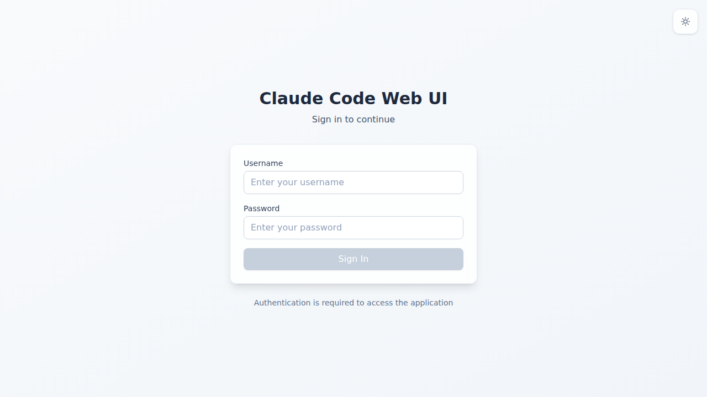
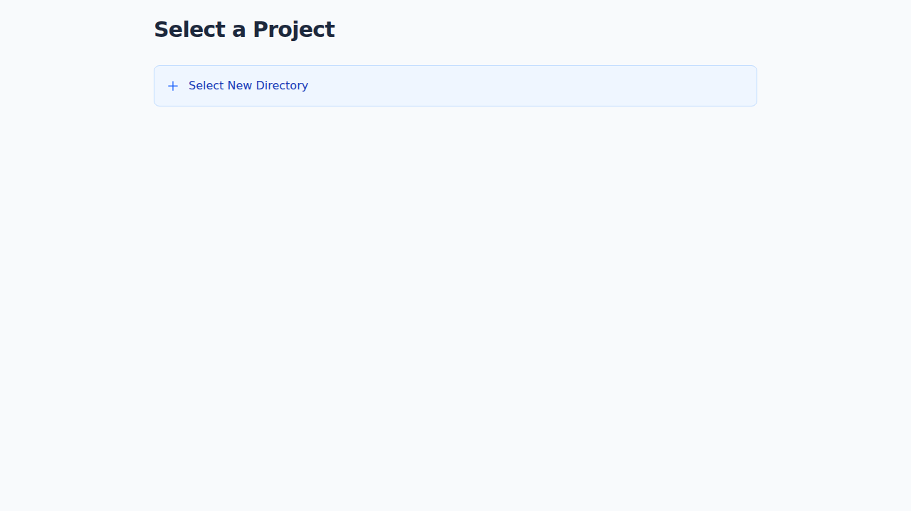

# 🌐 Claude Code Web UI

[](https://www.npmjs.com/package/claude-code-webui)
[](https://www.npmjs.com/package/claude-code-webui)
[](https://github.com/sugyan/claude-code-webui/blob/main/LICENSE)
[](https://github.com/sugyan/claude-code-webui/actions/workflows/ci.yml)
[](https://github.com/sugyan/claude-code-webui/releases)

> **A modern web interface for Claude Code CLI** - Transform your command-line coding experience into an intuitive web-based chat interface

[🎬 **View Demo**](https://github.com/user-attachments/assets/9a022b2c-1d87-4699-8266-b036427d0b61)

## 📱 Screenshots

<div align="center">

| Desktop Interface                                                                             | Mobile Experience                                                                           |
| --------------------------------------------------------------------------------------------- | ------------------------------------------------------------------------------------------- |
|  |  |
| _Chat-based coding interface with instant responses and ready input field_                    | _Mobile-optimized chat experience with touch-friendly design_                               |

</div>

<details>
<summary><strong>💡 Light Theme Screenshots</strong></summary>

<div align="center">

| Desktop (Light)                                                                            | Mobile (Light)                                                                           |
| ------------------------------------------------------------------------------------------ | ---------------------------------------------------------------------------------------- |
|  |  |
| _Clean light interface for daytime coding sessions_                                        | _iPhone SE optimized light theme interface_                                              |

</div>

</details>

<details>
<summary><strong>🔧 Advanced Features</strong></summary>

<div align="center">

| Desktop Permission Dialog                                                                              | Mobile Permission Dialog                                                                              |
| ------------------------------------------------------------------------------------------------------ | ----------------------------------------------------------------------------------------------------- |
|  |  |
| _Secure tool access with granular permission controls and clear approval workflow_                     | _Touch-optimized permission interface for mobile devices_                                             |

</div>

</details>

---

## 📑 Table of Contents

- [✨ Why Claude Code Web UI?](#-why-claude-code-web-ui)
- [🚀 Quick Start](#-quick-start)
- [⚙️ CLI Options](#-cli-options)
- [🚨 Troubleshooting](#-troubleshooting)
- [🔧 Development](#-development)
- [🔒 Security Considerations](#-security-considerations)
- [📚 Documentation](#-documentation)
- [❓ FAQ](#-faq)
- [🤝 Contributing](#-contributing)
- [📄 License](#-license)

---

## ✨ Why Claude Code Web UI?

**Transform the way you interact with Claude Code**

Instead of being limited to command-line interactions, Claude Code Web UI brings you:

| CLI Experience                | Web UI Experience            |
| ----------------------------- | ---------------------------- |
| ⌨️ Terminal only              | 🌐 Any device with a browser |
| 📱 Desktop bound              | 📱 Mobile-friendly interface |
| 📝 Plain text output          | 🎨 Rich formatted responses  |
| 🗂️ Manual directory switching | 📁 Visual project selection  |

---

## 🚀 Quick Start

Get up and running in under 2 minutes:

### Option 1: npm Package (Recommended)

```bash
# Install globally via npm
npm install -g claude-code-webui

# Start the server
claude-code-webui

# Open browser to http://localhost:8080
```

### Option 2: Binary Release

```bash
# Download and run (macOS ARM64 example)
curl -LO https://github.com/sugyan/claude-code-webui/releases/latest/download/claude-code-webui-macos-arm64
chmod +x claude-code-webui-macos-arm64
./claude-code-webui-macos-arm64

# Open browser to http://localhost:8080
```

### 🔐 Quick Start with Authentication

```bash
# Install globally via npm
npm install -g claude-code-webui

# Create .env file with credentials
echo "AUTH_USERNAME=admin" > .env
echo "AUTH_PASSWORD=your-secure-password" >> .env

# Start with authentication enabled
claude-code-webui

# Open browser - you'll see a login page
# Login with: admin / your-secure-password
```

### Option 3: Development Mode

```bash
# Backend (choose one)
cd backend && deno task dev    # Deno runtime
cd backend && npm run dev      # Node.js runtime

# Frontend (new terminal)
cd frontend && npm run dev

# Open browser to http://localhost:3000
```

### Prerequisites

- ✅ **Claude CLI** installed and authenticated ([Get it here](https://github.com/anthropics/claude-code))
- ✅ **Node.js >=20.0.0** (for npm installation) or **Deno** (for development)
- ✅ **Modern browser** (Chrome, Firefox, Safari, Edge)
- ✅ **dotenvx** (for development): [Install guide](https://dotenvx.com/docs/install)

---

## ⚙️ CLI Options

The backend server supports the following command-line options:

| Option                 | Description                                               | Default     |
| ---------------------- | --------------------------------------------------------- | ----------- |
| `-p, --port <port>`    | Port to listen on                                         | 8080        |
| `--host <host>`        | Host address to bind to (use 0.0.0.0 for all interfaces)  | 127.0.0.1   |
| `--claude-path <path>` | Path to claude executable (overrides automatic detection) | Auto-detect |
| `-d, --debug`          | Enable debug mode                                         | false       |
| `-h, --help`           | Show help message                                         | -           |
| `-v, --version`        | Show version                                              | -           |

### Environment Variables

- `PORT` - Same as `--port`
- `DEBUG` - Same as `--debug`
- `AUTH_USERNAME` - Username for basic authentication (enables auth when set with AUTH_PASSWORD)
- `AUTH_PASSWORD` - Password for basic authentication (enables auth when set with AUTH_USERNAME)

### Examples

```bash
# Default (localhost:8080, no authentication)
claude-code-webui

# Custom port
claude-code-webui --port 3000

# Bind to all interfaces (accessible from network)
claude-code-webui --host 0.0.0.0 --port 9000

# Enable authentication
export AUTH_USERNAME=admin
export AUTH_PASSWORD=securepass123
claude-code-webui

# Enable debug mode
claude-code-webui --debug

# Custom Claude CLI path (for non-standard installations or aliases)
claude-code-webui --claude-path /path/to/claude

# Using environment variables
PORT=9000 DEBUG=true claude-code-webui

# Complete production setup with authentication
export AUTH_USERNAME=admin
export AUTH_PASSWORD=your-secure-password
PORT=8080 claude-code-webui --host 0.0.0.0
```

---

## 🚨 Troubleshooting

### Claude CLI Path Detection Issues

If you encounter "Claude Code process exited with code 1" or similar errors, this typically indicates Claude CLI path detection failure.

**Quick Solution:**
```bash
claude-code-webui --claude-path "$(which claude)"
```

**Common scenarios requiring explicit path specification:**
- **Node.js environment managers** (Volta, asdf, nvm, etc.)
- **Custom installation locations**
- **Shell aliases or wrapper scripts**

**Environment-specific commands:**
```bash
# For Volta users
claude-code-webui --claude-path "$(volta which claude)"

# For asdf users
claude-code-webui --claude-path "$(asdf which claude)"
```

**Native Binary Installation:**
Currently **not supported** due to TypeScript SDK limitations. Please use npm/yarn installation:
```bash
npm install -g @anthropic-ai/claude-code
```

**Debug Mode:**
Use `--debug` flag for detailed error information:
```bash
claude-code-webui --debug
```

---

## 🔧 Development

### Setup

```bash
# Clone repository
git clone https://github.com/sugyan/claude-code-webui.git
cd claude-code-webui

# Install dotenvx (see prerequisites)

# Start backend (choose one)
cd backend
deno task dev    # Deno runtime
# OR
npm run dev      # Node.js runtime

# Start frontend (new terminal)
cd frontend
npm run dev
```

### Port Configuration

Create `.env` file in project root:

```bash
echo "PORT=9000" > .env
```

Run with dotenvx to use the `.env` file:

```bash
# Backend
cd backend
dotenvx run --env-file=../.env -- deno task dev    # Deno
dotenvx run --env-file=../.env -- npm run dev      # Node.js

# Frontend (uses Vite's built-in .env support)
cd frontend
npm run dev
```

Alternative: Set environment variables directly:

```bash
PORT=9000 deno task dev     # Deno
PORT=9000 npm run dev       # Node.js
```

---

## 🔒 Security Considerations

**Important**: This tool executes Claude CLI locally and provides web access to it.

### 🔐 Authentication (New!)

Claude Code Web UI now supports **optional basic authentication** to protect your interface:

```bash
# Set authentication credentials
export AUTH_USERNAME=your_username
export AUTH_PASSWORD=your_secure_password

# Start with authentication enabled
claude-code-webui
```

**Authentication Features:**
- **🔒 Secure login** - Username/password form with session management
- **🍪 HTTP-only cookies** - Secure session tokens with 24-hour expiry  
- **⚡ Zero-config** - Automatically enabled when credentials are set
- **🔄 Backwards compatible** - Disabled by default, no breaking changes

<details>
<summary><strong>📸 Authentication Screenshots</strong></summary>

<div align="center">

| Login Page                                                                                        | Authenticated Interface                                                                                    |
| ------------------------------------------------------------------------------------------------- | ---------------------------------------------------------------------------------------------------------- |
|                |        |
| _Secure login form with theme support_                                                           | _Main interface with logout button (top right)_                                                          |

</div>

</details>

### ✅ Safe Usage Patterns

- **🏠 Local development**: Default localhost access
- **📱 Personal network**: LAN access from your own devices  
- **🔐 Protected public access**: Enable authentication for broader network exposure

### ⚠️ Security Notes

- **🔐 Optional authentication**: Enable with AUTH_USERNAME and AUTH_PASSWORD
- **💻 System access**: Claude can read/write files in selected projects
- **🌐 Network exposure**: Configurable but requires careful consideration

### 🛡️ Best Practices

```bash
# Local only (most secure)
claude-code-webui --port 8080

# With authentication (recommended for network access)
export AUTH_USERNAME=admin
export AUTH_PASSWORD=your-secure-password-here
claude-code-webui --host 0.0.0.0 --port 8080

# .env file approach (recommended)
echo "AUTH_USERNAME=admin" >> .env
echo "AUTH_PASSWORD=your-secure-password-here" >> .env
claude-code-webui --host 0.0.0.0 --port 8080
```

**⚠️ Important:** Use strong passwords and HTTPS in production environments.

---

## 📚 Documentation

For comprehensive technical documentation, see [CLAUDE.md](./CLAUDE.md) which covers:

- Architecture overview and design decisions
- Detailed development setup instructions
- API reference and message types

---

## ❓ FAQ

<details>
<summary><strong>Q: Do I need Claude API access?</strong></summary>

Yes, you need the Claude CLI tool installed and authenticated. The web UI is a frontend for the existing Claude CLI.

</details>

<details>
<summary><strong>Q: Can I use this on mobile?</strong></summary>

Yes! The web interface is fully responsive and works great on mobile devices when connected to your local network.

</details>

<details>
<summary><strong>Q: Is my code safe?</strong></summary>

Yes, everything runs locally. No data is sent to external servers except Claude's normal API calls through the CLI.

</details>

<details>
<summary><strong>Q: How do I enable authentication?</strong></summary>

Set `AUTH_USERNAME` and `AUTH_PASSWORD` environment variables:

```bash
export AUTH_USERNAME=admin
export AUTH_PASSWORD=your-secure-password
claude-code-webui
```

Or use a `.env` file:
```bash
echo "AUTH_USERNAME=admin" > .env
echo "AUTH_PASSWORD=your-secure-password" >> .env
claude-code-webui
```

When authentication is enabled, users must login before accessing the interface.

</details>

<details>
<summary><strong>Q: Can I deploy this to a server?</strong></summary>

Yes! With authentication enabled, you can safely deploy to servers:

```bash
# Secure server deployment
export AUTH_USERNAME=admin
export AUTH_PASSWORD=your-secure-password
claude-code-webui --host 0.0.0.0 --port 8080
```

**⚠️ Important:** Use strong passwords and consider HTTPS for production deployments.

</details>

<details>
<summary><strong>Q: How do I update?</strong></summary>

Download the latest binary from releases or pull the latest code for development mode.

</details>

<details>
<summary><strong>Q: What if Claude CLI isn't found or I get "process exited with code 1"?</strong></summary>

These errors typically indicate Claude CLI path detection issues. See the [Troubleshooting](#-troubleshooting) section for detailed solutions including environment manager workarounds and debug steps.

</details>

---

## 🔗 Related Projects

**Alternative Claude Code Web UIs:**

- **[siteboon/claudecodeui](https://github.com/siteboon/claudecodeui)**
  - A popular web-based Claude Code interface with mobile and remote management focus
  - Offers additional features for project and session management
  - Great alternative if you need more advanced remote access capabilities

Both projects aim to make Claude Code more accessible through web interfaces, each with their own strengths and approach.

---

## 🤝 Contributing

We welcome contributions! Please see our [development setup](#-development) and feel free to:

- 🐛 Report bugs
- ✨ Suggest features
- 📝 Improve documentation
- 🔧 Submit pull requests

**Fun fact**: This project is almost entirely written and committed by Claude Code itself! 🤖  
We'd love to see pull requests from your Claude Code sessions too :)

---

## 📄 License

MIT License - see [LICENSE](LICENSE) for details.

---

<div align="center">

**Made with ❤️ for the Claude Code community**

[⭐ Star this repo](https://github.com/sugyan/claude-code-webui) • [🐛 Report issues](https://github.com/sugyan/claude-code-webui/issues) • [💬 Discussions](https://github.com/sugyan/claude-code-webui/discussions)

</div>
